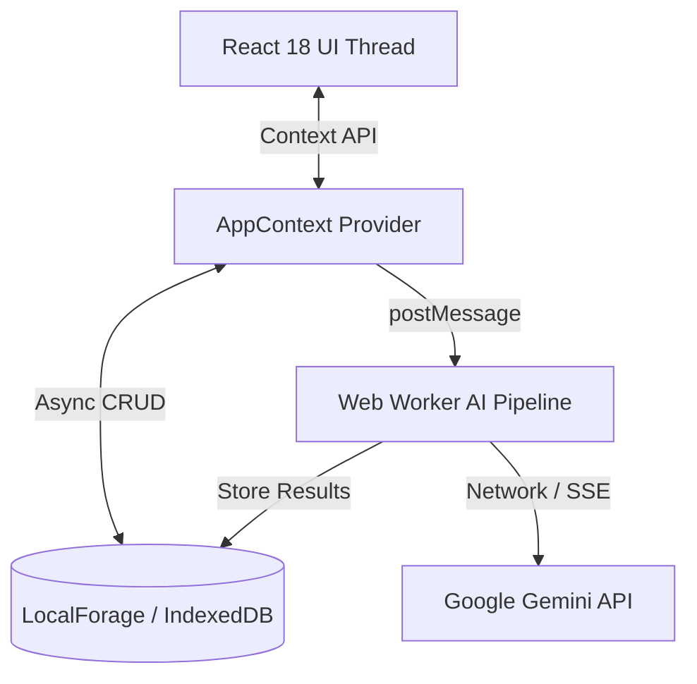

# MIMIRYX / YGGDRASIL
## Neural Knowledge Network & AI-Augmented Operations Suite
**Technical Specification, System Architecture & Engineering Report**

> **System Classification:** Single-Page Application (SPA) / Offline-First  
> **Core Frontend Stack:** React 18, TypeScript 5 (Strict), Vite 6, Tailwind CSS  
> **AI Subsystem:** Google Gemini Multi-Tier API + Web Worker Background Queue  
> **Persistence Engine:** LocalForage (IndexedDB Engine)  
> **Repository:** Alcend/Mimiryx_Ygddrasil  
> **Build Status:** Production Verified & Tested  

---

## 1. Executive Summary & What is MIMIRYX?

### 1.1 The Concept & Vision
**MIMIRYX** (codenamed **Project Yggdrasil**) is an engineered, client-side Neural Knowledge Workbench and personal learning operating system. Built for engineers, systems administrators, computer science students, and lifelong technical learners, it transforms traditional, passive note-taking into a living, visual digital organism that physically grows, interrogates comprehension, and autonomously synthesizes complex information.

```
                  ┌─────────────────────────────────────┐
                  │          MIMIRYX WORKBENCH          │
                  └──────────────────┬──────────────────┘
                                     │
         ┌───────────────────────────┼───────────────────────────┐
         ▼                           ▼                           ▼
┌───────────────────┐       ┌───────────────────┐       ┌───────────────────┐
│ 3D World Tree     │       │ 3D Grimoire       │       │ Autonomous AI     │
│ (Yggdrasil)       │       │ (BookReader)      │       │ Topic Creator     │
│ - Canvas Physics  │       │ - Active Recall   │       │ - Web Worker      │
│ - Canopy Clusters │       │ - Deep Dive Drone │       │ - Google Search   │
│ - 6 Major Realms  │       │ - 3-Col Layout    │       │ - Vector Placement│
└───────────────────┘       └───────────────────┘       └───────────────────┘
```

### 1.2 The Origin Story: Mythology Meets Cybernetics
The name **MIMIRYX** is inspired by **Mímir**—the renowned figure in Norse mythology who guards the Well of Wisdom (*Mímisbrunnr*) situated beneath the roots of the sacred World Tree, **Yggdrasil**—blended with modern neural and cybernetic themes.

The project originated out of frustration with conventional knowledge tools:
- Standard text files, Notepad, and flat wikis were exhausting to navigate and organize.
- Taking notes created the **"Illusion of Competence"**—the false sensation that writing or copying text equates to actual cognitive retention.
- Inspired by manhwas featuring World Trees and ascending realms, the concept evolved into a volumetric digital organism: as you study and master new concepts, the **Yggdrasil Tree** on the dashboard organically sprouts new foundational trunks, topic branches, and glowing neural engrams.

### 1.3 The Four Learning Bottlenecks Mimiryx Destroys

| Cognitive Bottleneck | Manifestation in Standard Apps | Mimiryx Engineered Solution |
| :--- | :--- | :--- |
| **The Stenographer Syndrome** | Mindlessly copying slides or transcribing text without active comprehension. | **Synaptic Dump Editor & Oracle AI:** Raw brain dumps are automatically structured, paginated, and synthesized into high-retention markdown chapters. |
| **Working Memory Crash** | Cognitive overload caused by searching flat nested folders and disjointed notes. | **Volumetric Yggdrasil Tree:** Spatial 3D canvas clustering that visualizes knowledge domains and hierarchical relationships. |
| **Illusion of Competence** | Assuming knowledge is mastered through passive re-reading, leading to exam/interview failure. | **Active Recall (Interrogation Mode):** Automatically censors bold terms and code blocks with glitch-boxes, forcing active memory retrieval practice. |
| **The Distraction Engine** | Context switching, pop-up notifications, open tabs, and auditory interruptions. | **Deep Dive (Sensory Deprivation Mode):** Single-toggle fullscreen mode paired with a Web Audio API 110Hz/164.8Hz ambient sci-fi drone pad. |

---

## 2. Core Functional Subsystems

### 2.1 The 3D Grimoire (`BookReader.tsx`)
Scrapping standard vertical scrolling, notes render as absolute 3D digital pages utilizing CSS 3D transforms (`perspective: 2500px`, `rotateY`).
- **3-Column Utility Layout (Desktop):**
  - **Left Column (`w-64`):** Suggested linkages, chapter index, and sibling node navigation.
  - **Center Column (`max-w-3xl`):** Optimal reading width constrained to 65–75 characters per line for eye-tracking ergonomics.
  - **Right Column (`w-72`):** Real-time cognitive telemetry (word count, reading pace, mastery status toggles).
- **Active Recall (Interrogation Mode):** Automatically injects black glitch-box masks over `<strong>` and `<code>` blocks, requiring users to actively retrieve the concept before hovering to reveal.
- **Deep Dive Focus:** Fullscreen sensory deprivation trigger accompanied by a detuned perfect fifth ambient audio pad (110Hz + 164.8Hz).

### 2.2 Volumetric Yggdrasil Canvas (`WorldTree/`)
Rendered directly via an optimized HTML5 Canvas render loop:
- **6 Primary Foundational Realms:** Foundations, Compute, Networking, Security, DevOps, Neural Architectures.
- **Procedural Fractal Engine:** Calculates cubic Bézier splines from the central root core outwards.
- **Canopy Clustering Engine:** Employs radial force-directed layout algorithms to prevent node overlap.
- **Interactive Camera HUD:** Smooth lerp interpolation for panning, zooming ($0.2\times$ to $3.0\times$), camera lock, and instant Node Inspector Drawer trigger.

### 2.3 Autonomous AI Topic Creator (`TopicCreatorPage.tsx` & `aiPipeline.worker.ts`)
A multi-stage pipeline that generates comprehensive curriculum trees from simple prompts:
1. **Query Expansion:** Deconstructs prompts into domain prerequisites.
2. **Grounded Stream Research:** Queries Google Gemini with search grounding tools, falling back to direct generative synthesis upon quota or rate limit triggers.
3. **Structured Chapter Synthesis:** Formats content with YAML frontmatter, LaTeX math formulas, and `[PAGE_BREAK]` continuity tags.
4. **Client-Side Vector Placement:** Fetches 768-dimensional embeddings and calculates Cosine Similarity locally to automatically assign parent realms and topics.

### 2.4 Interactive IT Tutor & Lab Sandboxes (`TutorPage.tsx`, `LabDetailPage.tsx`)
- **Conversational SRE Tutor:** An AI persona acting as a principal systems engineer guiding conceptual troubleshooting.
- **Simulated Terminal Labs:** Interactive CLI sandboxes for bash command execution, DNS/subnet troubleshooting, and container diagnostics with live output verification.

### 2.5 Study Kanban Board (`BoardPage.tsx`)
A drag-and-drop Kanban workflow supporting 4 mastery columns: Backlog, In Progress, Review, and Mastered, featuring content-driven column sizing and dynamic dashed dropzones.

---

## 3. How Did We Build It? (Engineering & Architecture)

### 3.1 Technical Stack Summary
- **Frontend Core:** React 18, TypeScript 5 (Strict Mode), Vite 6.
- **Styling Architecture:** Tailwind CSS 3.4 with strict 4px spacing tokens (`4, 8, 12, 16, 24, 32, 48, 64px`) and cyber-theme tokens (`cyan`, `green`, `purple`, `amber`).
- **Client-Side Storage:** LocalForage (IndexedDB async engine).
- **Background Computing:** Dedicated Web Worker (`aiPipeline.worker.ts`).
- **Markdown & Math Rendering:** `react-markdown`, `remark-gfm`, `remark-math`, `rehype-katex`, `rehype-sanitize`.
- **Quality Assurance:** Vitest, Playwright, ESLint, TypeScript Compiler (`tsc --noEmit`).

### 3.2 Offline-First Database Engine
To guarantee zero-latency performance and prevent the browser's 5MB `localStorage` limit from breaking large datasets, MIMIRYX uses **LocalForage** over IndexedDB:
- Asynchronous non-blocking reads and writes.
- Schema entities: `Realms`, `Topics`, `Notes`, `Labs`, `BoardCards`, `AIJobs`, `SystemMetrics`.
- Integrated JSON Backup/Restore Engine (`ImportExportModal.tsx`) for zero-dependency portability.



### 3.3 Autonomous Web Worker & State Machine
Heavy AI stream processing, token decoding, and embedding calculations are isolated in a background Web Worker (`aiPipeline.worker.ts`):
- **Job States:** `QUEUED` $\rightarrow$ `RESEARCHING` $\rightarrow$ `SYNTHESIZING` $\rightarrow$ `COMPLETED` / `FAILED_TRANSIENT` (retrying with exponential backoff) / `DEAD_LETTER`.
- **Bring Your Own Key (BYOK):** Multi-key keyring in local storage. Automatic failover and cooldown tracking when encountering `429 Too Many Requests` or `403 Forbidden`.
- **RequestCache (5-min TTL):** Deduplicates identical research prompts within 5 minutes to protect API quota.
- **Self-Healing Continuity Engine:** Automatically detects broken code fences across `[PAGE_BREAK]` tags and closes/reopens them cleanly.

### 3.4 Client-Side Vector Mathematics
Instead of sending existing tree hierarchies back to LLMs for classification (costly in tokens and latency), MIMIRYX performs local vector calculations:
- Queries the dynamically discovered embedding model (`models.list` filtering by `embedContent`).
- Generates 768-dimensional embeddings for incoming topics.
- Calculates dot-product **Cosine Similarity**:
  $$\text{Cosine Similarity} = \frac{\mathbf{A} \cdot \mathbf{B}}{\|\mathbf{A}\| \|\mathbf{B}\|}$$
- Places the topic into the nearest realm or parent branch with sub-millisecond execution time.

### 3.5 Code Splitting & Performance Optimizations
- **Route-Level Dynamic Imports:** All 16 pages are code-split using `React.lazy()`.
- **React Lazy Loading Invariant:** All lazy routes are encapsulated within `<ErrorBoundary>` harnesses and cybernetic `<Suspense>` loaders to prevent black-screen crashes.
- **Manual Chunk Splitting:** Configured in `vite.config.ts` (`vendor-markdown` chunk for KaTeX and markdown parsers) ensuring the primary entry bundle remains lightweight ($< 150\text{ kB}$).

---

## 4. Verification, Testing & QA Results

| Testing Harness | Target Module | Validation Scope | Result |
| :--- | :--- | :--- | :--- |
| **Vitest Unit Suite** | `src/utils/topicHelpers.ts` | 9 tests: Direct match, slug resolution, tag fallbacks, null safety | **PASSED** (4ms) |
| **Vitest Unit Suite** | `src/utils/aiConfig.ts` | Import safety, constant immutability, zero side-effect loading | **PASSED** (2ms) |
| **Playwright E2E** | Navigation & Routing | Full root-to-notes, topic drilldown, and settings modal verification | **PASSED** (2.5s) |
| **Vite Production Build** | Full Codebase (`tsc`) | Zero TypeScript errors, clean vendor chunk splitting | **PASSED** (9.46s) |

---

## 5. Engineering Roadmap

- **30-Day Milestone:** Deploy serverless AI backend proxy to eliminate client-side key storage; implement LRU cache eviction for IndexedDB.
- **60-Day Milestone:** Integrate on-device local vector embeddings via WebAssembly (`Transformers.js`) for 100% offline semantic clustering.
- **90-Day Milestone:** Package native cross-platform desktop installers (Tauri / Rust backend) and launch collaborative peer-to-peer study rooms.
